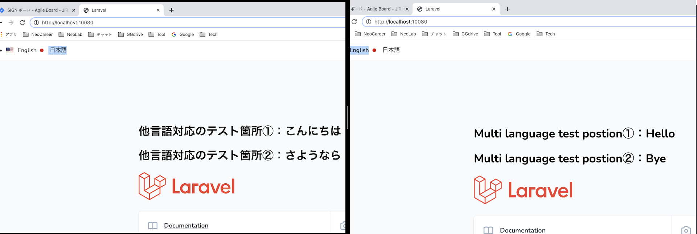
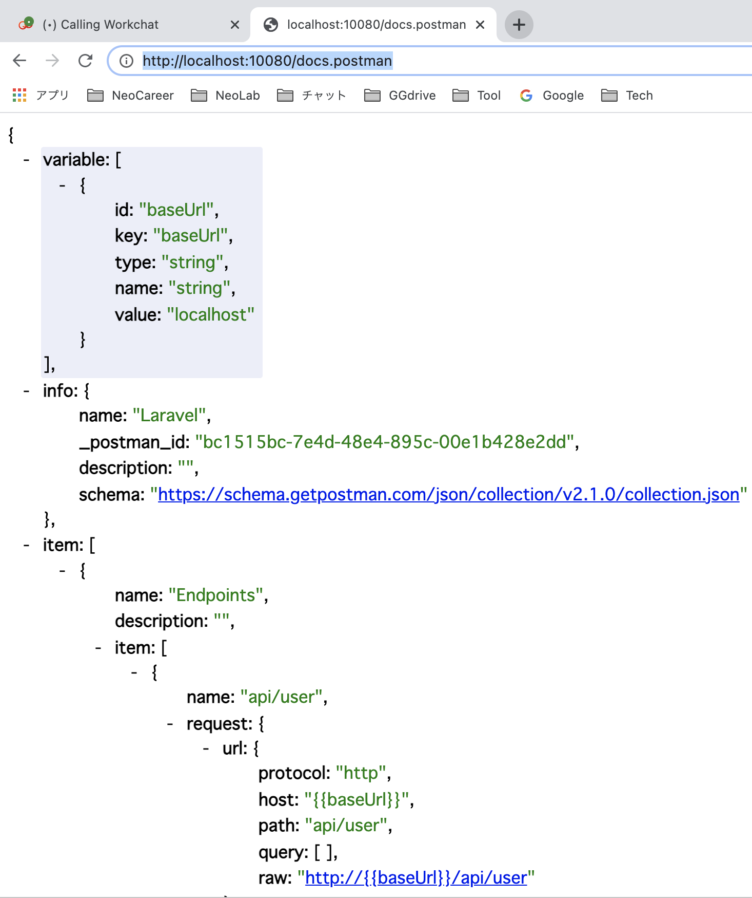
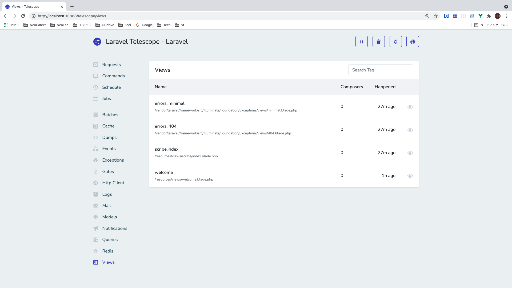

# Vue2 Laravel8 Docker template 🚀🐳




## localdeploy
- `docker-compose up -d --build`
- `docker-compose exec app bash`
- `[app] $ composer install`
- `[app] $ cp .env.example .env`
- `[app] $ php artisan key:generate`
- browser: access "localhost:10080"
- `[app] $ php artisan migrate`

## connect DB
1. in CLI
- `docker-compose exec db bash -c 'mysql -u${MYSQL_USER} -p${MYSQL_PASSWORD} ${MYSQL_DATABASE}'`
- `mysql> show tables;`
2. by tools (MySQL Workbench)
- username: `root`
- pw: `secret`
- port: `33060`

## output log
- edit in `backend/.env`: `LOG_CHANNEL=stderr`
- edit in `backend/routes/web.php`:
```php
Route::get('/', function () {
    logger('welcome route.');
    return view('welcome');
});
```
- `docker-compose logs -f app`
- browser: access "localhost:10080" => will see 'welcome route.' in log console

## check versions
1. PHP: `[app] # php -v`
>(PHP info: `[app] # php -m`)
2. composer: `[app] # composer -v`
3. laravel: `[app] $ php artisan -v`

## backend

### multi language
- `backend/config/app.php: 'faker_locale' => 'vi_vn',`
- `% docker-compose exec app bash`
- `php artisan db:seed` => auto generated 3 VNese records in DB: `laravel_local.users`

### scribe doc generator
https://scribe.readthedocs.io/

#### 1) install
1.
```shell
composer require --dev knuckleswtf/scribe
```
2.
```bash
php artisan vendor:publish --provider="Knuckles\Scribe\ScribeServiceProvider" --tag=scribe-config
```
- => create `/config/scribe.php`

#### 2) setting

1. `/config/scribe.php`: `'type' => 'laravel',`
2. create doc comment in `*Controller.php`


#### 3) generate
```shell
php artisan scribe:generate
```

#### 4) result
1. access browser `http://localhost:10080/docs/`

2. click `View Postman collection`


### passport
#### just for 1st time when create Laravel project
1. `composer require laravel/passport`
2. `php artisan migrate`
3. `php artisan passport:install`
4. `php artisan make:controller UserController`
5. `php artisan make:request UserRegister/UserLogin/UserChangePass`

#### for every time clone repo
1. `php artisan passport:install`

+ Signup: `http://localhost:10080/api/auth/onsignup`


+ Login: `http://localhost:10080/api/auth/onlogin`


+ Get user: `http://localhost:10080/api/auth/me`


+ Change PW: `http://localhost:10080/api/auth/changepw`

+ Logout: `http://localhost:10080/api/auth/onlogout`


### telescope
https://viblo.asia/p/gioi-thieu-ve-laravel-telescope-Qbq5Qvq4KD8#_http-requests-9

#### 1) install
```sh
composer require laravel/telescope --dev
php artisan telescope:install
php artisan migrate
```
- backend/config/app.php: `// App\Providers\TelescopeServiceProvider::class,`
- backend/app/Providers/AppServiceProvider.php:
```php
    public function register()
    {
        if ($this->app->environment('local')) {
            $this->app->register(\Laravel\Telescope\TelescopeServiceProvider::class);
            $this->app->register(TelescopeServiceProvider::class);
        }
    }
```

- backend/composer.json:
```json
    "extra": {
        "laravel": {
            "dont-discover": [
                "laravel/telescope"
            ]
        }
    },
```

#### 2) config
- 2-1/ Data Pruning

+ backend/app/Console/Kernel.php:

```php
    protected function schedule(Schedule $schedule)
    {
        $schedule->command('telescope:prune --hours=48')->daily();
    }
```

- 2-2/ Dashboard Authorization (just for DEV/STG/PROD environments)

+ backend/app/Providers/TelescopeServiceProvider.php:

```php
    protected function gate()
    {
        Gate::define('viewTelescope', function ($user) {
            return in_array($user->email, [
                'do.tranquang@neo-career.co.jp',
            ]);
        });
    }
```

#### 3) result

- access browser `http://localhost:10080/telescope`
- Requests:


**************************


- Commands:


- Views:


